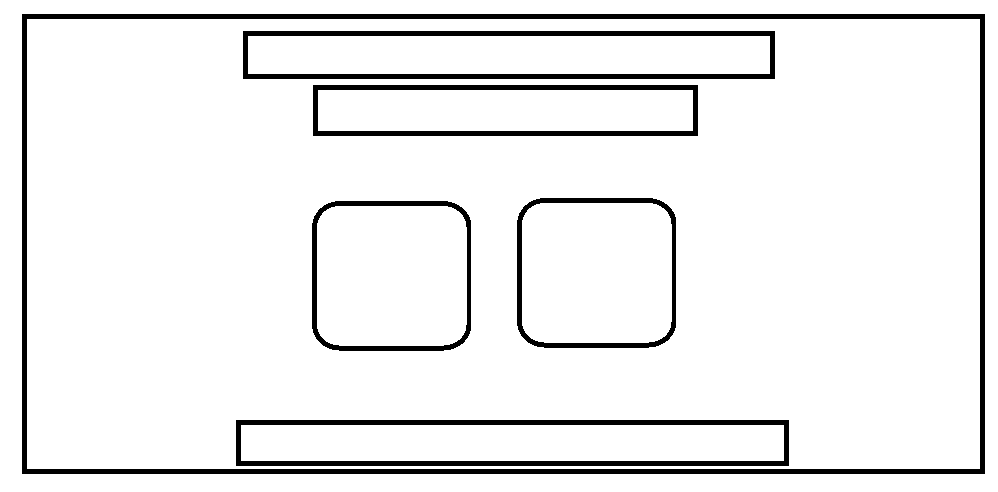
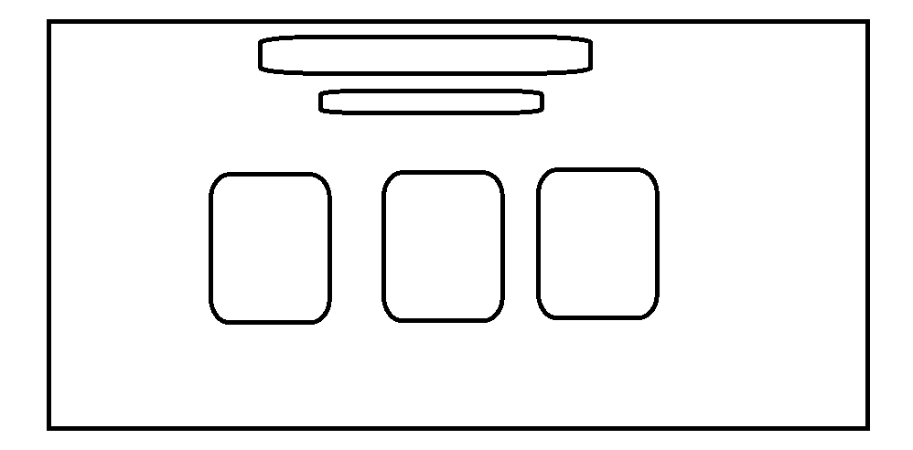
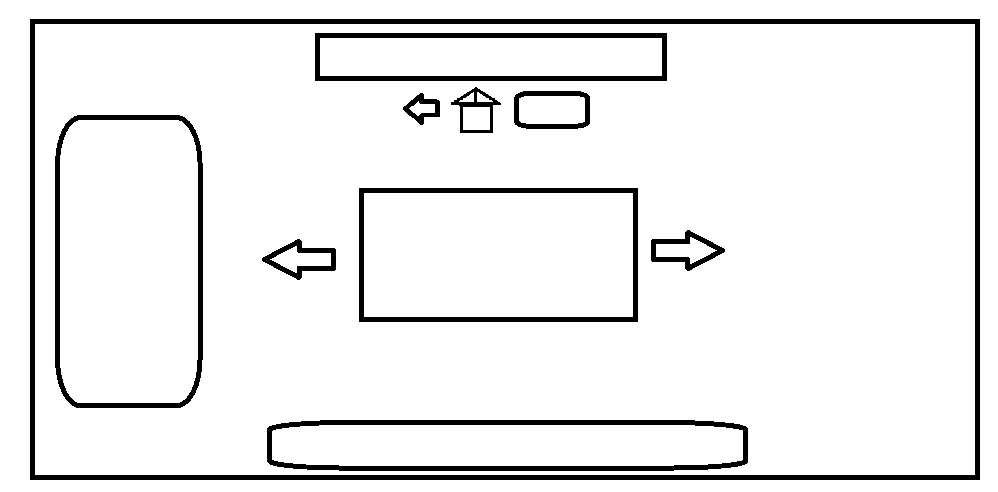
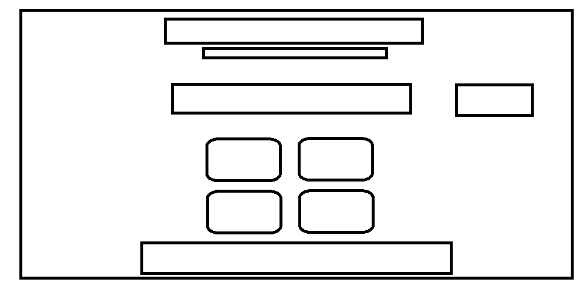
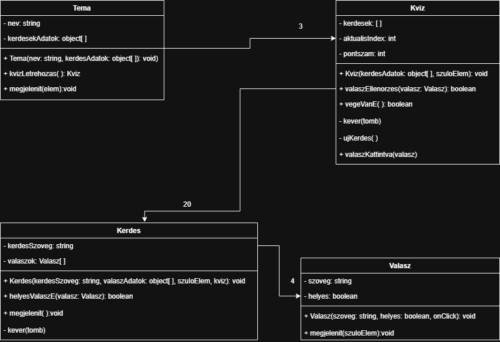

# Quizcards - Molnár Beatrix, Mágori Ferenc

---

## Pages Link: https://frnc36.github.io/QuizCards/

---

## Projekt leírása

A QuizCards egy egyszerű webes tanulókártya és kvíz alkalmazás. Az alkalmazás célja, hogy a felhasználó különböző témakörökben gyakorolhasson kérdések és válaszok segítségével.

A felhasználó először tanulókártyákon keresztül átnézheti az adott témakör kérdéseit, majd kvíz módban tesztelheti a tudását.
A kvíz során az alkalmazás pontszámot számol, visszajelzést ad a válaszokra, majd a végén eredményt jelenít meg.

A projekt során fontos szempont az objektum-orientált felépítés, a tiszta felelősségi körök kialakítása, valamint a Cypress end-to-end tesztelés.

## Specifikációk

### Főmenü

- Tanulókártya vagy Kvíz mód kiválasztása

### Tanulókártya

- Kategória választás
- Kártya megfordítása

### Kvíz

- Kérdések megjelenítése
- Több válaszlehetőség megjelenítése
- Válasz kiválasztása
- Helyes vagy hibás válasz visszajelzése
- Pontszám számítása
- Következő kérdésre lépés
- Eredményoldal megjelenítése
- Kvíz újrakezdése(felugró ablak)

## Tovább fejlesztések

- Sötét mód

### Kvíz

- Időzítő

### Tanulókártya

- Kártyák tanulandó lista

## Drótvázak

### Főmenü

### Témaválasztó

### Tanulókártya

### Kvíz

## UML ábra

## Feladat kiszotás

| Bea          | Feri         |
| ------------ | ------------ |
| Tanulókártya | Kvíz         |
| Főmenü       | Témaválasztó |

## Tesztelés(majd)

- Cypress tesztek a fő felhasználói folyamatokra
